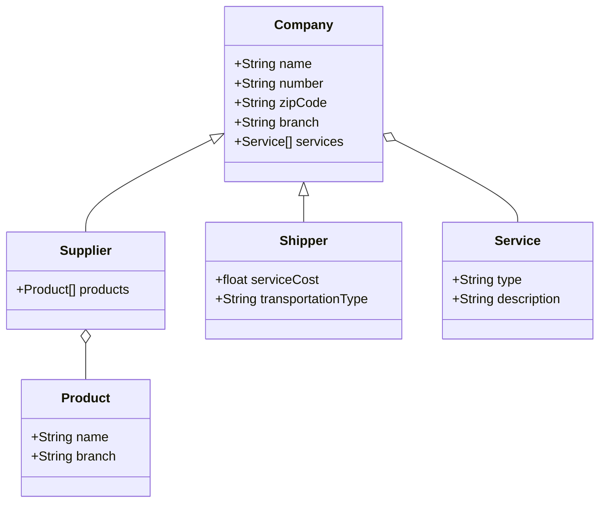

# Supplier Api

## Class Diagram

```mermaid
classDiagram
    class Company {
        +String name
        +String number
        +String zipCode
        +String branch
        +Service[] services
    }

    class Supplier {
        +Product[] products
    }

    class Shipper {
        +float serviceCost
        +String transportationType
    }

    class Service {
        +String type
        +String description
    }

    class Product {
        +String name
        +String branch
    }

    Company <|-- Supplier
    Company <|-- Shipper
    Company o-- Service
    Supplier o-- Product
```
