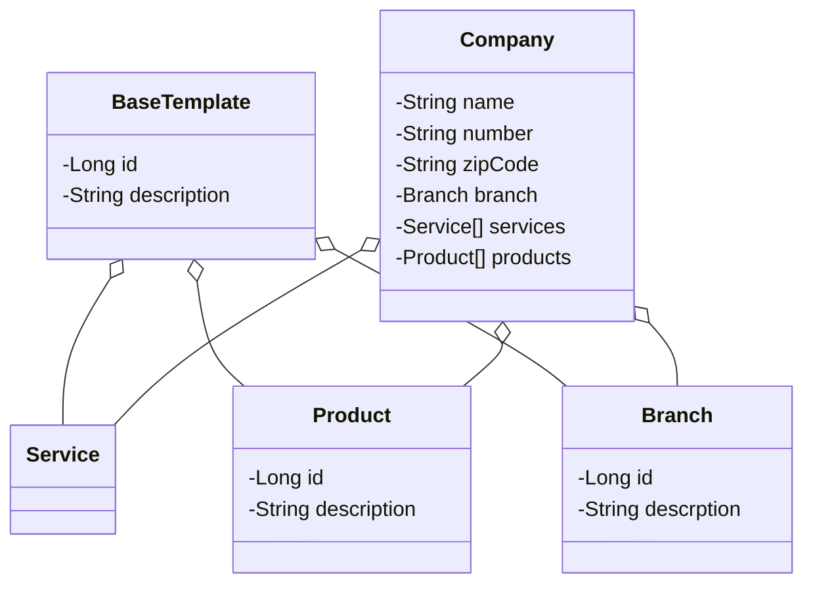

# Supplier Api

## Class Diagram

```mermaid
classDiagram
    class Company {
        -String name
        -String number
        -String zipCode
        -Branch branch
        -Service[] services
        -Product[] products
    }

    class BaseTemplate {
        -Long id
        -String description
    }

    class Service {
    }

    class Product {
        -Long id
        -String description
    }

    class Branch {
        -Long id
        -String descrption
    }

    BaseTemplate o-- Service
    BaseTemplate o-- Product
    BaseTemplate o-- Branch
    Company o-- Service
    Company o-- Product
    Company o-- Branch
```
