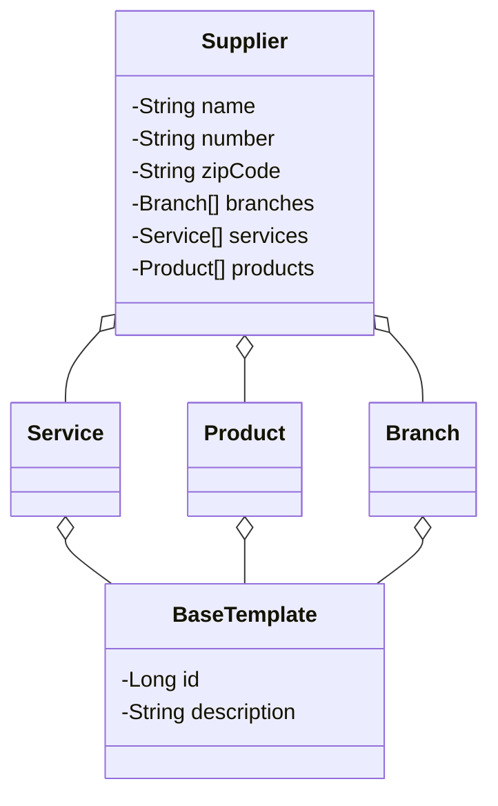

# Supplier Api

## Class Diagram

```mermaid
classDiagram
    class Supplier {
        -String name
        -String number
        -String zipCode
        -Branch[] branches
        -Service[] services
        -Product[] products
    }

    class BaseTemplate {
        -Long id
        -String description
    }

    class Service {
    }

    class Product {
    }

    class Branch {
    }

    Service o-- BaseTemplate
    Product o-- BaseTemplate
    Branch o-- BaseTemplate
    Supplier o-- Service
    Supplier o-- Product
    Supplier o-- Branch
```
